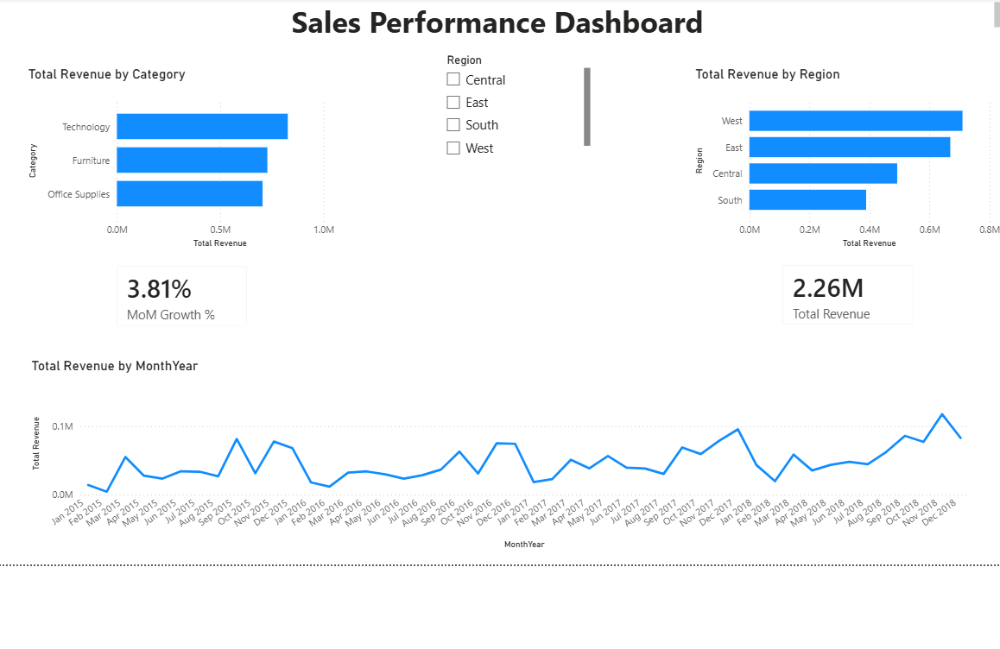

# Sales Performance Dashboard

An interactive Sales Performance Dashboard built in Power BI, using a retail sales dataset. Connects and transforms raw sales data, models a proper date table, and visualizes revenue trends, regional performance, and category breakdowns.



## Objective

Build an interactive dashboard that enables quick identification of top-performing regions and underperforming product categories, alongside overall revenue trends over time.

## Tools Used

- **Power BI Desktop** — report building and visualization
- **Power Query** — data import and transformation
- **DAX** — calculated measures and a custom date table for time intelligence

## Dataset

- **Source:** Superstore Sales Dataset (~9,800 orders, Jan 2015 – Dec 2018)
- **Fields used:** Order Date, Region, Category, Sub-Category, Sales

## Data Preparation

- Imported the raw CSV via Power Query and validated column data types (Order Date parsed as Date, Sales as Decimal Number)
- Built a dedicated **Date table** using `CALENDAR()`, marked as the official date table, and related it to the sales table — this ensures accurate time-intelligence calculations (e.g., Month-over-Month growth) regardless of gaps in the raw order dates
- Added a `MonthYear` column (formatted as "Jan 2015") with a numeric sort-order column, so the monthly trend line displays in correct chronological order

## DAX Measures

```DAX
Total Revenue = SUM(train[Sales])

MoM Growth % = 
DIVIDE(
    [Total Revenue] - CALCULATE([Total Revenue], DATEADD(DateTable[Date], -1, MONTH)),
    CALCULATE([Total Revenue], DATEADD(DateTable[Date], -1, MONTH))
)
```

## Dashboard Features

- **KPI Cards** — Total Revenue and Month-over-Month Growth %
- **Bar Charts** — Revenue by Region, Revenue by Product Category
- **Trend Line** — Total Revenue by Month, spanning the full 2015–2018 timeline
- **Slicer** — interactive Region filter, dynamically updating all visuals on the page

## Key Insight

Total revenue reached **2.26M** across the dataset, with a Month-over-Month growth rate of **3.81%**. The West and East regions lead in total revenue, while Technology is the top-performing product category — useful signals for where to focus sales and marketing effort.

## Repo Structure

```
sales-performance-dashboard/
├── README.md
└── screenshots/
    └── dashboard_overview.png
```
